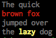

# highlight

highlight is a small command-line utility to colorize stdin via regex matches.

## Install

```sh
go get -u github.com/augustoroman/highlight
```

## Example usage

```sh
echo -e "The quick \nbrown fox \njumped over\nthe lazy dog" | highlight -c 'white+d' -l red fox -w 'yellow+b' lazy
```



